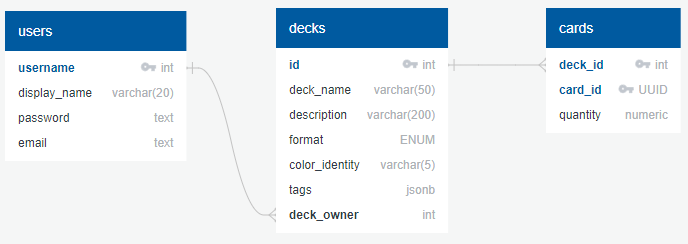

# Capstone Project - Magidekt
This project is a Magic The Gathering deck-builder inspired by [Archidekt](https://archidekt.com/) and uses the [Scryfall API](https://scryfall.com/docs/api).

This is the Backend for this project.  
The Frontend for this project can be found [here](https://github.com/jvill171/magidekt-frontend).

## Schema
My Schema file can be seen here: [magidekt-schema](https://github.com/jvill171/magidekt-backend/blob/main/magidekt-schema.sql)

Here's an illustration of my schema:  

## ROUTES

| Method | Endpoint                             | Authentication            | Description                           |
|--------|--------------------------------------|----------------------------|---------------------------------------|
| **POST**   | `/auth/token`                        | -                          | Login                                 |
| **POST**   | `/auth/register`                     | -                          | Register                              |
| **GET**    | `/decks`                             | -                          | Get all decks in DB (Paginated)       |
| **GET**    | `/decks/:deckId`                     | Login                      | Get a specific deck                   |
| **GET**    | `/users`                             | Admin                      | Get all users                         |
| **POST**   | `/users`                             | Admin                      | Create a user account                 |
| **GET**    | `/users/:username`                   | Correct User or Admin      | Get a specific user account           |
| **PATCH**  | `/users/:username`                   | Correct User or Admin      | Update user account                   |
| ****DELETE**** | `/users/:username`                   | Correct User or Admin      | Delete user account                   |
| **GET**    | `/users/:username/decks/`            | Login                      | Get all decks by a specific user      |
| **POST**   | `/users/:username/decks/`            | Correct User or Admin      | Create an empty deck                   |
| **GET**    | `/users/:username/decks/:deckId`     | Login                      | Get a specific deck, including its cards |
| **PATCH**  | `/users/:username/decks/:deckId`     | Correct User or Admin      | Update deck details, excluding cards   |
| ****DELETE**** | `/users/:username/decks/:deckId`     | Correct User or Admin      | Remove a specific deck                 |
| **POST**   | `/users/:username/decks/:deckId/cards` | Correct User or Admin    | Get cards in a specific deck           |
| **POST**   | `/users/:username/decks/:deckId/cards` | Correct User or Admin    | Add cards to a specific deck           |
| **PATCH**  | `/users/:username/decks/:deckId/cards` | Correct User or Admin    | Update existing cards in a specific deck |
| ****DELETE**** | `/users/:username/decks/:deckId/cards` | Correct User or Admin    | Remove cards from a specific deck      |
